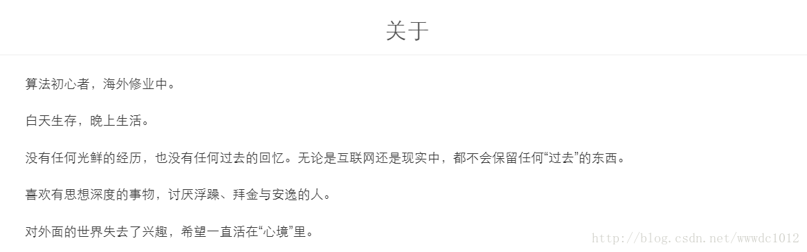
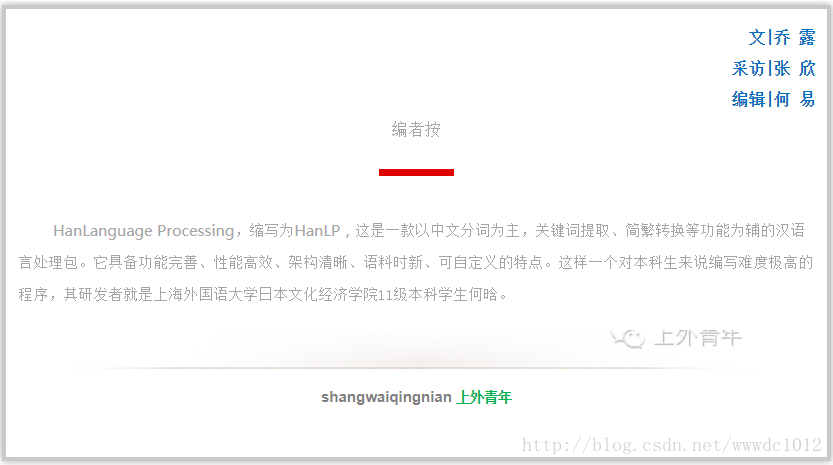
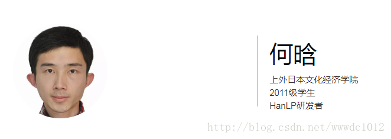
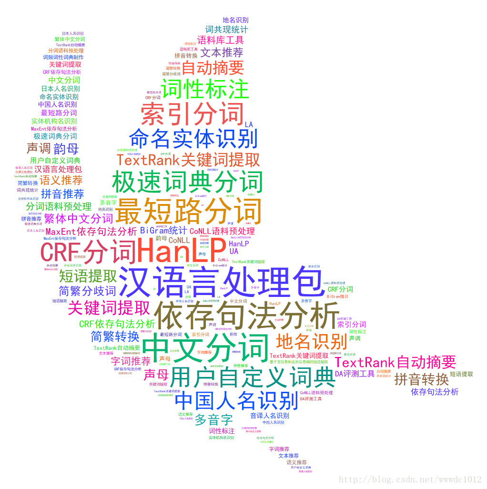

# 【上外青年】人物 ‖ 何晗：天才都是异类

原创 小旋锋 最后发布于2017-09-11 14:28:08 阅读数 1900  收藏

---

偶尔发现一个博客，如下

> [码农场 - 放牧代码和思想 专注自然语言处理、机器学习算法](http://www.hankcs.com/)
> http://www.hankcs.com/

------

有时候会想，为什么有些人趋于平凡，而有些人似乎注定不平凡。
人与人之间的根本区别是什么呢？

---

> 算法初心者，海外修业中。
>
> 白天生存，晚上生活。
>
> 没有任何光鲜的经历，也没有任何过去的回忆。无论是互联网还是现实中，都不会保留任何“过去”的东西。
>
> 喜欢有思想深度的事物，讨厌浮躁、拜金与安逸的人。
>
> 对外面的世界失去了兴趣，希望一直活在“心境”里。
>

---

> 现转载 上外青年 微信公众号的一篇 人物 ‖ 何晗：天才都是异类，表示我的敬仰

## 人物 ‖ 何晗：天才都是异类

HanLanguage Processing，缩写为HanLP，这是一款以中文分词为主，关键词提取、简繁转换等功能为辅的汉语言处理包。它具备功能完善、性能高效、架构清晰、语料时新、可自定义的特点。这样一个对本科生来说编写难度极高的程序，其研发者就是上海外国语大学日本文化经济学院11级本科学生何晗。

#### ▌秤砣虽小，能压千斤

何晗介绍说，HanLP程序是一个让计算机理解人类语言的工具。

汉语与拉丁语系等其他一些由字母构成的语言之间存在较大差异，其最大的区别是中文的单词与单词之间没有空格隔开。外国人不知道如何把一篇中文文章拆成单个的单词去理解，所以学习汉语时就会觉得十分困难。

同样，计算机在理解汉语时首先需要将汉语句子拆分。“但是（计算机）目前的一些做法是比较机械的，是遇到一个单词就拆出来。”

何晗举了一个例子来解释计算机这种容易产生歧义的拆分方式。例如“商品和服务”这样一个简短的句子，按照以前陈旧的做法，计算机会将它拆分为“商品”、“和服”、“务”。

“很明显它就理解错了。我要做的就是找出最正确的拆分方式。”何晗说，“这个程序最基本的作用就是把一篇文章里面的句子都拆成单词，而且不会产生歧义。”

此外，该程序还具有简繁转换等功能。

他认为，在以语言为优势的上外，学生们对翻译都有一个很深的了解，众所周知的是，目前机器翻译的效果是不理想的。不过，何晗表示，现在已经形成了一门让机器去处理语言的学科，叫做“自然语言处理”。“我相信这个（指机器翻译）在未来会得到一定的改观。”

研发这个程序，对何晗来说是顺理成章的。

“当时我是在上海林原科技有限公司做兼职，他们让（我）做一个相关的工具，我就开始做了。然后越做越多，越来越多的功能都被追加上去，直到现在。”

当时他也没有想太多，只是想认真把手头的工作做好，在毕业后申请大学时，“可以有一个像样的东西给教授看”。

#### ▌石以砥焉，化钝为利

“我从最开始就觉得这个问题并不是特别的难。在前期的调查、文献研究、的过程中（我）觉得这个是可以拿下的。”

在开发过程中，何晗不可避免地遇到了很多困难。“因为这个东西原本是不属于一个本科生做的”。在对自然语言处理方面知识匮乏的情况下，何晗在网上查阅了很多的论文，也去看了别人是怎么做的。同时他也在其中添加了自己的构想。

何晗的同学和家人都对他进行的工作并不理解。独自进行程序研发的他也很难与同事产生共鸣。他所获得的鼓励，多半来源于互联网。

“有时候我会看一些书，写一些笔记，然后会根据那些问题提出解决方案，贴到博客上面去。有些读者会跟我联系，说这个东西不错，然后他们也会提一些自己的问题。”

何晗把课本都扫描成pdf格式，上课时就带上电脑，偶尔开个小差写写程序。“上海的一些高校感觉氛围都比较自由，上外也是个比较自由的地方，比较适合做这些事。”

他所在的国际经济与贸易专业开设了高等数学和统计学课程，何晗表示，这两门课，尤其是统计学，“对程序的一些算法和设计是有帮助的”。

何晗编写计算机程序已经不是第一次了。在他大一的时候还给上外做过wifi的客户端。“适当去做一些时代的东西也从很早就开始了”。

对于自己所取得的成绩，何晗表示自己要感想教授高等数学的罗雪梅老师，“她是一个很负责任的老师”。

谈及上外网络信息中心的张文正老师，何晗说：“当时我在考虑将来到底干什么的时候，他指导了我一个创新创业项目，在他的影响下坚定了我继续走计算机道路的决心。”

#### ▌尘埃之外，卓然独立

在何晗初涉大学生活时，他和其他同学没什么差别。但在他开始做兼职之后，“跟大家就感觉完全不一样了”。

最早是在大二下学期的暑假，何晗的同学有的出国，有的旅游，但是只有他是一个人在宿舍里面干活。“那个时候我就知道我可能跟大家不是一样的人”，所以之后他也并不理会别人对他的看法。
“毕竟天才都是异类。”

但是在他眼中，自己只是一个“草根”。作为计算机业余爱好者的他与“正规军”相形见绌。

他表示：“如果我能得到更正规的教育，可能我会做一些别人做不出来的东西。”

但是在一些特殊问题，尤其是专业性强的问题上，“我觉得可能我自己比某些学术论文的教授看得都深。”因为教授着重于学术方面的研究，而他更专注于产品的研发。

何晗认为，如果自己能够顺利地进入学术界，可能会做一些不一样的贡献。

在进入上外的那一刻起，何晗明白，在外语方面，来自内陆的学生与沿海城市、发达城市自小就接触外语的学生没有处于同一水平线上。

但他认为，“计算机是人类发明的最公平的东西。”只要有因特网，有电脑，再买几本书，任何人都可以开始编程。

“有无数的人在网络上免费地帮你，你提个问题会有人回答你；不懂的东西打到google上去搜一下，相关的一些博客有很多，大家会告诉你这个怎么搞。你最后可以学出一些东西出来，而且学到的东西可以很快就变成经济价值，也能找到很高薪的工作。”

虽然在高中时期，何晗就对计算机有着浓厚的兴趣，但在填报志愿时，他并没有选择计算机专业。他认为，自己喜欢这门学科，但进入这个专业未必是一件好事。

“有些人会说两个相爱的人结婚了，就是把他们的爱情葬送了。有些人会说你喜欢某件事情，然后你从事和这个相关的行业，你就把这个兴趣丢掉了。”

相反，在上外这个宽松自由的环境之下，何晗能够做自己喜欢的事业，并取得骄人的成就。这也是上外对多类型人才的包容所在。

————————————————
版权声明：本文为CSDN博主「小旋锋」的原创文章，遵循 CC 4.0 BY-SA 版权协议，转载请附上原文出处链接及本声明。
原文链接：https://blog.csdn.net/wwwdc1012/article/details/77932656

