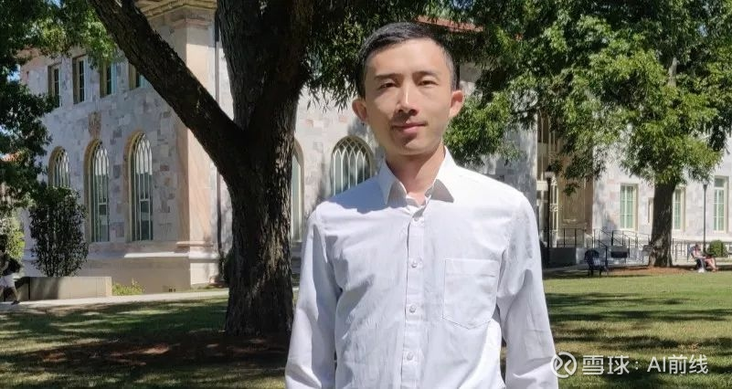
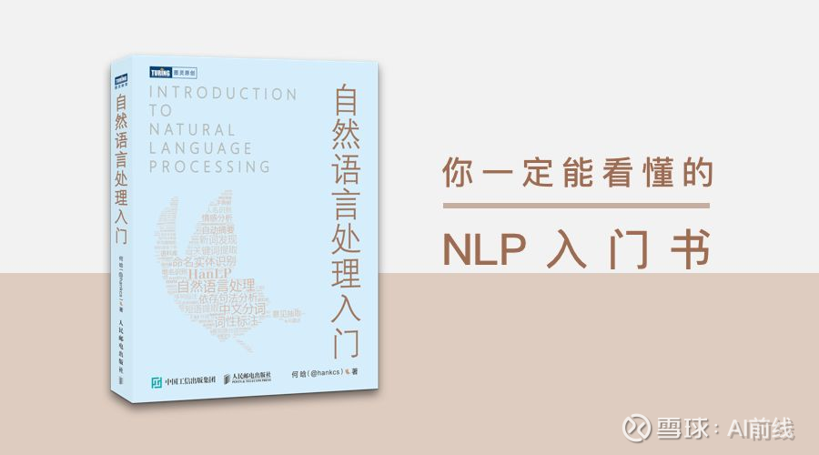

[AI前线](https://xueqiu.com/aifront)

来自雪球[发布于2019-11-02 21:41](https://xueqiu.com/9217191040/135107720)

# 跨专业自学NLP，这个90后撸出了开源类库HanLP，已在GitHub收获1.5W星

作者 | 刘燕

采访嘉宾 | 何晗，NLP 类库 HanLP 作者

编辑 | Linda

**AI 前线导读：**截止 2019 年 10 月底，一款名为 HanLP 的自然语言处理类库在 GitHub Star 数达到了 15.5 K，超过了宾夕法尼亚大学的 NLTK、斯坦福大学的 CoreNLP、哈尔滨工业大学的 LTP。这是一款由一系列模型与算法组成的自然语言处理（NLP）开发工具包。
你或许想象不到，这款 NLP 工具包被开发出来时，它的作者何晗，还是一位日语专业的大二学生。如今，在攻读博士期间，何晗又创作了一本《自然语言处理入门》，希望解决小白们的 NLP 入门难题。该书得到了周明、刘群、王斌等业内顶级 NLP 专家的推荐。
“理论是根，项目是树“，如果说 HanLP 是树，那么这本《自然语言处理入门》便是树的根基。在该书问世之际，AI 前线与何晗展开对话，了解这位极具天赋的学生“种植树”，“培育根”的故事。**更多优质内容请关注微信公众号“AI 前线”（ID：ai-front）**

痴迷游戏走上编程之路

和很多90后一样，何晗爱好动漫和游戏。这两个爱好后来也深深影响了他最为关键的两次重大人生抉择。

高中时，何晗就读于黄冈中学理科“状元班”，班上学霸云集，但何晗觉得自己和那些学霸同学比差远了。“我肯定不是学霸，我属于那种均值 80 分，方差特别大的类型”。

他笑称自小不喜欢听讲，要不就自己看书做题，要不就坐在座位上神游。有几次考试，他超常发挥进入了“状元班”。不过，最为关键的高考，他却考得并不理想。

这次高考失利让何晗决定“放飞自我”，选一个自己喜欢的专业。因为喜欢动漫，在志愿填报时他选了日语专业。2011 年，何晗成为上海外国语大学日语系的一名学生。他的业余时间也几乎都被追新番、背单词、宅着打游戏填满。

打游戏是何晗走上编程之路的原始动力，他挺想自己做一个游戏出来。曾经有一段时间，何晗痴迷打“仙剑四”，他想把剑四的“mod”给做出来。

也是从那时候起，何晗开始尝试学习各种编程知识：C++、Windows 编程、3D 编程、汇编逆向、PHP、JavaScript、Linux。对于一个非科班出身的人来说，自学之路免不了遇到困难。何晗坦言，最大的困难是没有机会系统性学习操作系统、编译原理等专业课程。他倒是有一个很实用的学习方法 — debug。

何晗的 debug 能力很强，“不管是什么算法谁的代码，我都能一行行 debug 下来。每次我写的算法不对的时候，我都会创造相同的输入数据，开两个 debugger 窗口，一个跑我的，一个跑别人的。我的知识大部分来源于调试别人的代码，可以说是‘偷师’自所有人”。

最令何晗印象深刻的是，他自学编程途中达成的一个小成就。当时上外的校园网仅支持网页版登录，打开较慢、登录时也无法记住密码，很不方便。为了解决这个问题，何晗花了一个劳动节假期做出了一个自动登录软件。现在回想起来，何晗坦言这个软件还有很多不足，但同学们用的很开心。

这个小成就还让何晗收获了一个意外之喜。学校网络技术中心的张老师听说了这事后对他很是赞赏，便赠送给他一个校园网 VIP，还给他介绍了一家外包公司——林原科技的兼职。

大二开发出 NLP 类库

也正是这份兼职工作，让何晗与自然语言处理（NLP）结下了不解之缘，后者也是他目前攻读博士期间的研究方向。

一日，林原科技立项做一个 “智能检索系统”。中文搜索引擎的第一步是分词，老板分配给何晗一个任务——做一个分词器，并给了他几本厚厚的学习资料。

老实说，这是何晗第一次接触 NLP，显然做出这个分词器得需要“现学现卖”了。他倒颇有几分自信，“我应该能拿下”，“要么不做，要做就要做最好的“。

经过调研，何晗发现，市面上的开源工具 Jieba、Ansj、IK 等分词效果都不太理想，很多人名、机构名别称分不出来，新词隔三差五就更新却收录不进去，分词速度也很慢.... 他当即决定，一定要做出一个体验效果好的分词器。

紧接着，何晗开始了一边“泡”在专业书和论文里自学一边开发的过程。张华平、刘群等 NLP 领域专家的论文几乎都被他翻了个遍，被一些深奥概念绕的云里雾里那自是家常便饭。对何晗影响最大的是吕震宇开源的 C# 版的 ICTCLAS 分词系统，他边学 C# 边对照着吕震宇的博文研读这才搞懂了 ICTCLAS 分词原理。何晗尝试着在 ICTCLAS 的基础上做了一些改进，并且实现了 Java 版，这个版本运行速度很慢，好在输出的结果跟 ICTCLAS 是一致的。

弄懂了 ICTCLAS 之后，何晗又开始学习单步 Ansj，Ansj 的数据结构——双数组字典树速度之快对他来说像打开了新世界的大门。于是他便饶有兴趣地开始研究数据结构，最后他自己创造出了一个“基于双数组字典树的 AC 自动机”的数据结构。

功夫不负有心人，花了半年时间，何晗最终还是将这个分词器做了出来，并取名“HanLP”。这对于一个大二日语专业学生来说，是极为难得的。何晗用上了自研的基于双数组字典树的 AC 自动机，这大大提升了 HanLP 的运行速度。

第一版本的 HanLP 功能比较简单，后续经过几年的迭代，其功能越来越完善，性能更高效。HanLP 能提供词法分析、句法分析、文本分类、情感分析等功能。此外，HanLP 还具有精度高、速度快、内存省的特点。

截止目前，HanLP 的 GitHub Star 数已达 15.5 K，超过了宾夕法尼亚大学的 NLTK、斯坦福大学的 CoreNLP、哈尔滨工业大学的 LTP。

对于这个成绩，何晗很开心，他感激广大用户的认可。“从开发者的角度讲，我肯定是不及教授们的万分之一，无论是水平上还是人数上”，何晗表示，相对于上述面向教学和学术用途的项目，HanLP 是个人项目，主要面向生产环境开发，由于目的用途不同，HanLP 取胜的“法宝”在于良好的用户体验，在接口设计、代码风格等“软实力”方面比较人性化。

博士出书

HanLP 的意外成功让何晗对 NLP 有了更深入的了解，在开发这个项目的过程中，通过对领域内专业知识的学习，他领略到了 NLP 这门学科的魅力，在随后的学习生涯中，他便锁定 NLP 为主要的研究方向。目前何晗在埃默里大学读计算机博士，主要的研究方向是句法分析、语义分析与问答系统。  

何晗

从 v1.3 版本起，HanLP 由大快搜索主导开发，并完全开源（GitHub 开源地址：[网页链接](https://github.com/hankcs/HanLP)）。2018 年 11 月，HanLP 更新到了 1.7 版本，新增文本聚类，流水线分词等功能，这时 HanLP 的中文词法分析已比较成熟，达到了工业使用的水准。

现在，何晗仍在负责 GitHub 上 HanLP 的维护工作。HanLP 令何晗收获了一众粉丝，他们常常来找何晗咨询一些 NLP 专业相关的问题，时间长了，问题越积越多，何晗试图帮助一些初级用户找一些入门资料，却遗憾找不到特别对口的。适逢出版社的编辑找他约稿，何晗索性决定，干脆自己写一本入门资料。

在这样的背景下，这本《自然语言处理入门》的定位很快明确下来：普通人入门时看的第一本 NLP 书，小白也能看懂的工具书。何晗还希望该书能为读者指明下一步的方向，因此在入门内容的基础上，他加上了一些挑战章节。

2019 年 10 月，历时 1 年创作、十几遍校对，《自然语言处理入门》正式出版（了解更多书籍信息可点击阅读原文），该书还得到了周明、刘群、王斌等业内顶级 NLP 专家的推荐。

“理论是根，项目是树“，如果说 HanLP 是树，那么这本《自然语言处理入门》便是树的根基。

与创作 HanLP 时期相比，何晗已经从小白蜕变成了领域专家，不变的地方在于，何晗仍将“工程与理论相结合”作为创作的核心理念，他试图在目前市面上艰深晦涩的教科书和简单的入门书之间作出平衡。何晗以自己的开源项目为案例，代码对照公式讲解每一个算法每一个模型，希望让读者知其然并且知其所以。

NLP 现在最大的问题是难以表示世界知识

采访中，何晗对于 NLP 及句法分析、语义分析、问答系统目前的发展现状和发展趋势分享了自己的精彩观点。

Transformer 大家族狂欢的一年

何晗表示，今年是以 BERT 为首的 Transformer 大家族狂欢的一年，自从发现在大规模无标注语料上训练的 Transformer 语言模型可以编码很多知识后，各项任务包括对话系统都在研究怎么接入 Transformer。这些研究令人振奋，在另一层意义上也有些单调无聊。虽然从结果上来看效果的确提升了许多，但模型的可解释性还不够。谁都知道知识肯定编码进去了，但究竟是如何编码、为什么能编码、如何精简参数等等，还在研究当中。

英文句法分析摸到了天花板

句法分析和语义分析都可以归结为为每个单词找被修饰词，然后标注它们的关系。针对这种类型的任务，BiAffine 是比较前沿的做法。它属于基于图的算法家族，天然适合并行化，在 GPU 下速度很快。此后还涌现了许多“改进”研究，大致朝着高阶建模的方向走。不过，何晗认为，英文句法分析基本摸到了天花板，中文句法分析可能不是差在模型而是差在高质量大规模树库上。

至于语义依存分析，与句法分析模型一样，只不过语料库的建设比其滞后。同属语义分析家族的另几项任务，问句转 SQL、抽象语义表示则稍微平凡一些，基本上都是 Seq2Seq 的变种。对于上述的所有任务，如何有效地将问题表示为向量才是核心问题。这时候，又轮到 Transformer 霸榜了。

未来机器学习工程师岗位会减少

谈到 NLP 现在发展中的挑战，何晗表示，NLP 现在最大的问题是难以表示世界知识，举个例子，每个人都有一套对物理世界的认识，但计算机只有一些符号语料。“人们都说百闻不如一见，目前的 NLP 系统别说见了（机器视觉），连闻都很少闻（语音处理）”。

但就学界的前沿动态而言，**在模型结构的探索上 AutoML（自动设计神经网络），以及在知识工程上的自动构建知识图谱，**都是未来可预见的发展趋势。

就工业界而言，**未来机器学习工程师的岗位反而会减少，因为神经网络可以自行设计神经网络，**就不需要这么多工程师手动设计了。到时候，**软件开发将进入 2.0 时代，不用再写代码，而是标注数据**。标注数据丢给神经网络学习模型，模型的结构也是神经网络自动探索出来的，这个模型用来解决实际问题。软件工程师不需要写一行代码，或者说，他们标注的数据就是他们的代码。神经网络是他们的编译器，训练出来的神经网络是他们编译后的程序。正如编译器可以编译编译器一样，神经网络也可以训练神经网络。这就是未来最有潜力的技术。

写在最后

现在读到博士了，何晗的生活依旧简单，除了日常学习，他最爱的还是动漫和游戏。

维护 HanLP 之外，何晗还业余经营着一个名为“码农场”的博客，用于自己的课程笔记分享。由于太忙，这几年“码农场”的更新频率已经降到了以“年”为单位，不过，日常仍有数千粉丝来这里翻阅资料。

从该博客的一隅，或许可以一窥何晗的另一面。

在“码农场”的资料介绍处，何晗称自己是一个算法初心者。大二时兼职开发 HanLP，何晗常常一个人坐在教室忙活，同学们完全不知道在干什么，“大部分女同学认为我就是个码农，修电脑的那种；有的男同学觉得我很 low，有的觉得我很酷“，何晗从来不解释，他觉得做自己就好了。

他亦是一位算法坚守者，从兼职接触到如今锁定研究方向，他一直在自己喜欢的领域保持专注。采访最后，何晗告诉我们，毕业后，他会选择继续扎根学术。

嘉宾介绍

作者何晗（[@hankcs](http://xueqiu.com/n/hankcs)），曾经是上外一名日语专业的学生，如今是美国埃默里大学计算机博士生，研究方向是句法分析、语义分析与问答系统。何晗写的自然语言处理类库 HanLP，截至 2019 年 10 月初，GitHub Star 数已达 15 K，超过了宾夕法尼亚大学的 NLTK、斯坦福大学的 CoreNLP、哈尔滨工业大学的 LTP。何晗的 “码农场”播客也是很多 NLP 领域朋友参考的学习资料。何晗写作的《自然语言处理入门》书籍已经上市，感兴趣的可以点击「阅读原文」购买。

福利时间

我们将联合图灵出版社给 AI 前线的粉丝送出《自然语言处理入门》纸质书籍 6本！

**方式一：在本文下方留言给出你想要这本书的理由，截至开奖时间，留言点赞数最高的前 3 位赠送本书（留言择优放出）。****开奖时间：11 月 6 日（周三）18:00，获奖者每人获得一本。**

**方式二：长按识别下图小程序，参与我们的抽奖活动，由小程序随机抽出 3 位赠送本书。开奖时间：11 月 6 日（周三）18:00，获奖者每人获得一本。另附购买地址，请戳****「阅读原文」**

注意：如果两种方式均获奖的读者，仅送出一本。本活动最终解释权归 AI 前线所有。 

今日荐文

点击下方图片即可阅读

血泪控诉：曝光数月的AMD代码bug毁掉了我的周末

**你也「在看」吗？**